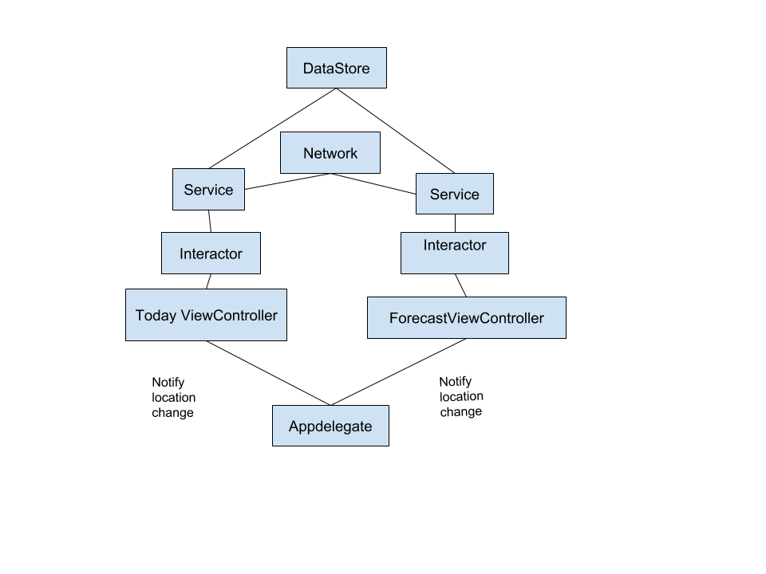

# WeatherForecast app

In this project i made a simple weather app with the following features:

- Get Location from GeoLocation
- Get weather data according to device location
- Offline mode: save Location and weather data in preferences for offline mode and in Firebase and I used for storing in Firebase the device UUID instead of userid because we don't have user registration/login as a requirement.
- Handle scenario if user denied access to Location
- Handle api error

Note: Precipitation field was not found in the api result.

### Architecture

In this project I have implemented a scalable, maintainable and testable application, I had chosen a simple architecture, fast in terms of development time based on 3 components:

- Interactor/Presenter

- Service

- ViewController

 
#### Advantages

- Create unit testing for interactor, mocking service and the dataStore layer.

- Faster development process

- Writing clean code and separate business logic code from the UI.

**Interactor**: This is the “mediator” between the Service and the ViewController. It have input and output protocol where it communicates with ViewController and pass the parameters to the service. The Service will returns a response and the Interactor will pass it back to ViewController.

**Service**: This layer will handle all API/Core data calls. It is initiated by the interactor. It get the data and return them back to interactor.

  
### Storage

Data Storage is singleton layer responsible to store data

### Communication

The communication between the components is done with protocols.

